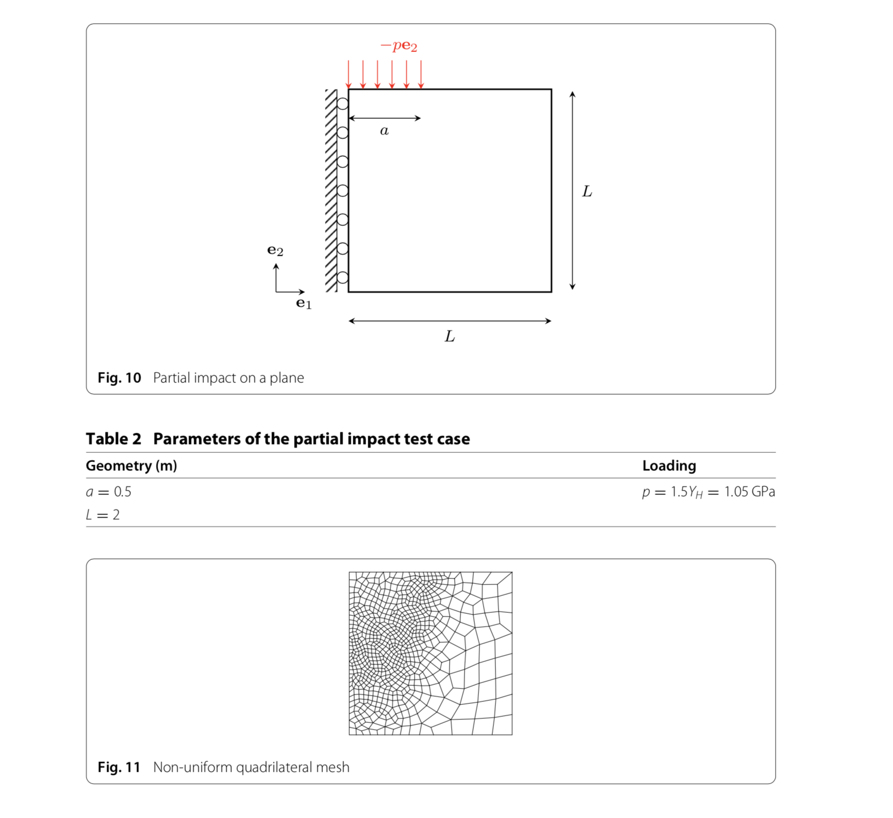
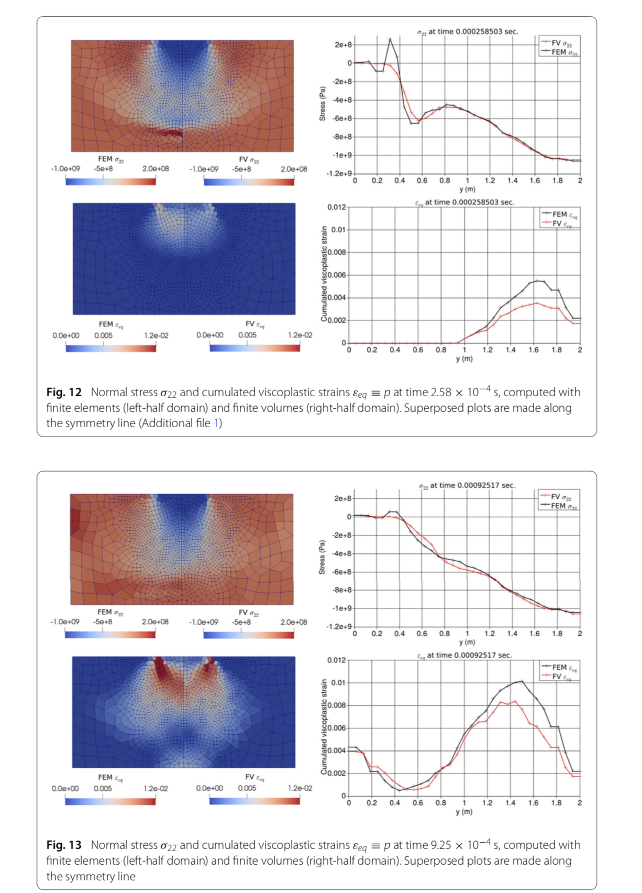
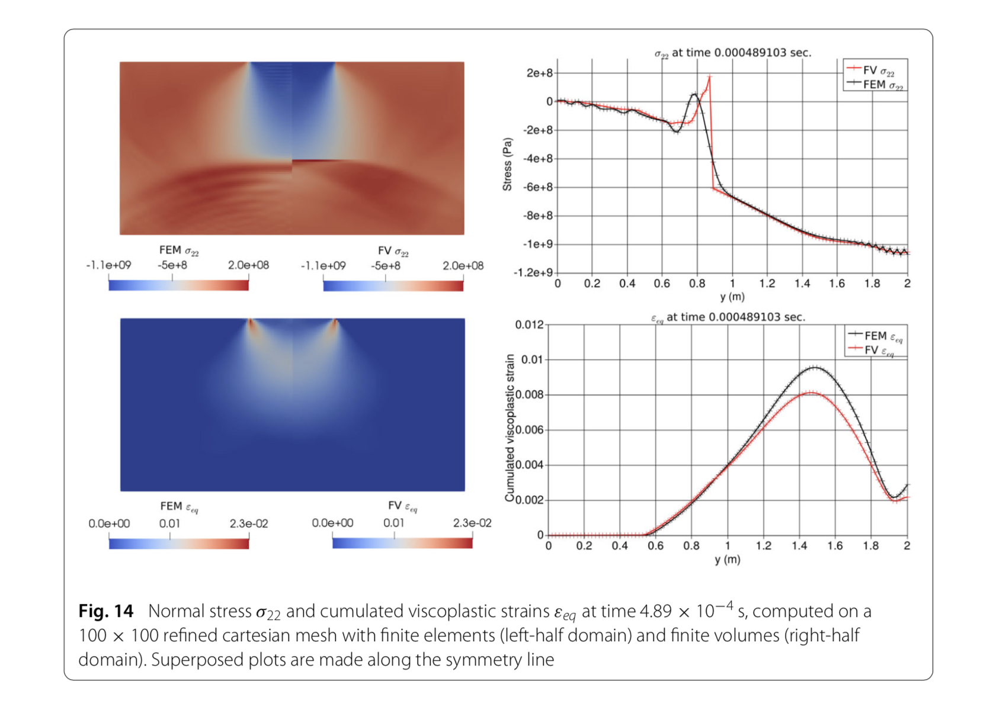

# Master Thesis 

# Riemann solver for non-linear Green-Naghdi II Thermal Equations

This thesis presents the Riemann solution for non linear Green Naghdi dissipationless energy thermal equation which is also know as type II. The classical theory of heat conduction based on the Fourier law allows infinite diffusion speed which is not well accepted from a physical point of view. The Green and Naghdi employ a procedure which differs from the usual one.They introduce the notion of thermal displacement so that thermal waves propagate at finite speed and constitutive equation for entropy flux is determined by potential function. This work is focused on the solution of a Riemann problem for Green-Naghdi II equations, which are hyperbolic and these equations are formulated according to some internal energy or free energy potential describing the constitutive response. The solution to the Riemann problem is derived according to a linearized thermal response as well as a nonlinear . It is shown that the solution of such a Riemann problem can be used in a finite volume solver.

# Test Case 

# Results FEM vs FVM

